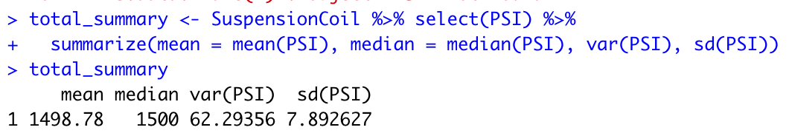
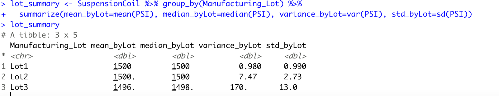

# MechaCar_Statistical_Analysis
R - dyplr, tidyverse

## Linear Regression to Predict MPG 
The summary statistics output of the linear regression of prediciting MPG on all of the variables 

Predicting the MPG values through linear regression provides the following information:
  - Variable that provides non random amounts of variance are:
      - based on the results from the regression analysis the estimated variables with the 
      non random variances are to be vehicle length, and ground clearance with their    extremeley minute p values. The smallness of the p value makes these variables statistically likely to provide non random amounts of variance. 
     

## Summary Statistics on Suspension Coils 
The summary statistics on suspension coil is performed through the summarize function in 2 different ways described below:

  - Total Summary Statistics of Suspension Coils PSI
  
  
  - Summary Statistics of Suspension Coils PSI By Lot Number
  
  
  The design specifications for the MechaCar suspension mandate that the variance does not surpass 100 thus as seen in the data above the manufacturing data meets design specifiction as in total, but not by each lot individually. The variance level for the total lots combined is 62.29356 which is below 100. However, when taken by each lot individually it is shown that Lot 3 does not meet design requirements becasue the variable exceeds 100 with the value of 170. 
  

