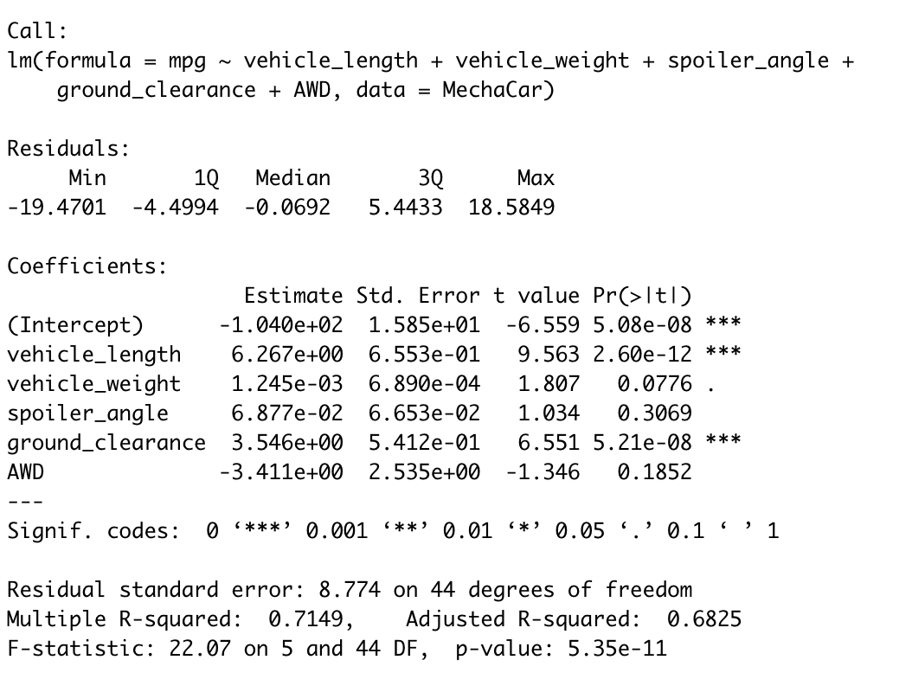

# MechaCar_Statistical_Analysis
R - dyplr, tidyverse

## Linear Regression to Predict MPG 
The summary statistics output of the linear regression of prediciting MPG on all of the variables 

Predicting the MPG values through linear regression provides the following information:
  - Variable that provides non random amounts of variance are:
      - based on the results from the regression analysis the estimated variables with the 
      non random variances are to be vehicle length, and ground clearance with their    extremeley minute p values. The smallness of the p value makes these variables statistically likely to provide non random amounts of variance. 
     
      

