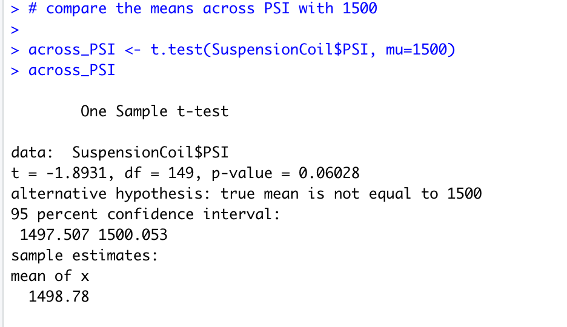

# MechaCar_Statistical_Analysis
R - dyplr, tidyverse

## Linear Regression to Predict MPG 
The summary statistics output of the linear regression of prediciting MPG on all of the variables 

Predicting the MPG values through linear regression provides the following information:
  - Variable that provides non random amounts of variance are:
      - based on the results from the regression analysis the estimated variables with the 
      non random variances are to be vehicle length, and ground clearance with their    extremeley minute p values. The smallness of the p value makes these variables statistically likely to provide non random amounts of variance. 
     

## Summary Statistics on Suspension Coils 
The summary statistics on suspension coil is performed through the summarize function in 2 different ways described below:

  - Total Summary Statistics of Suspension Coils PSI
  
  
  - Summary Statistics of Suspension Coils PSI By Lot Number
  
  
  The design specifications for the MechaCar suspension mandate that the variance does not surpass 100 thus as seen in the data above the manufacturing data meets design specifiction as in total, but not by each lot individually. The variance level for the total lots combined is 62.29356 which is below 100. However, when taken by each lot individually it is shown that Lot 3 does not meet design requirements becasue the variable exceeds 100 with the value of 170. 
  
## T-Tests on Suspension Coils
The t-tests to determine if the PSI means in different subgroups / all together are statistically different or not from the population mean of 1500 pounds per square inche are shown below:

 - PSI across all manufacturing lots
 
 
 The p-value being 0.06028 leads to our failure to reject the null hypothesis that the true population mean is 1500. Therefore the mean PSI across all manufacturing lots is not statistically different from the population mean of 1500 pounds per square inch. 
 
 - PSI in subgroups based on Lot number
 
 
 The p-values for Lot 1 and Lot 2 are 1 and 0.6072 respectively, and thus lead to the conclusion that their mean is not statistically different from the population mean of 1500. However, Lot 3 has the p-value of 0.04168 which means that the mean of PSI in lot 3 is statistically different from 1500 pounds per square inch. Therefore for lot 3 we reject the null that the true population mean is 1500. 
 
 
 ## Study Design: MechaCar vs Competition
 
 A statistical study on MechaCar's average upkeep cost on their cars versus competitors would be beneficial to consumers as well as MechaCar. Comparing the cost of maintenance and the frequence of maintenance on the average owner of a population consumers of MechaCar versus a population of consumers of other automotive brands can be done by a t-test in order to compare the mean values. This test can predict the typical cost of owning MechaCar versus another brand and thus can persuade consumers to go with MechaCar for its reliability. 
In this test the metrics will be the average spending on repairs for MechaCar products and competitor products. The null hypothesis being that the average spending on MechaCar repairs are less costly than those of competitor product repairs. 
